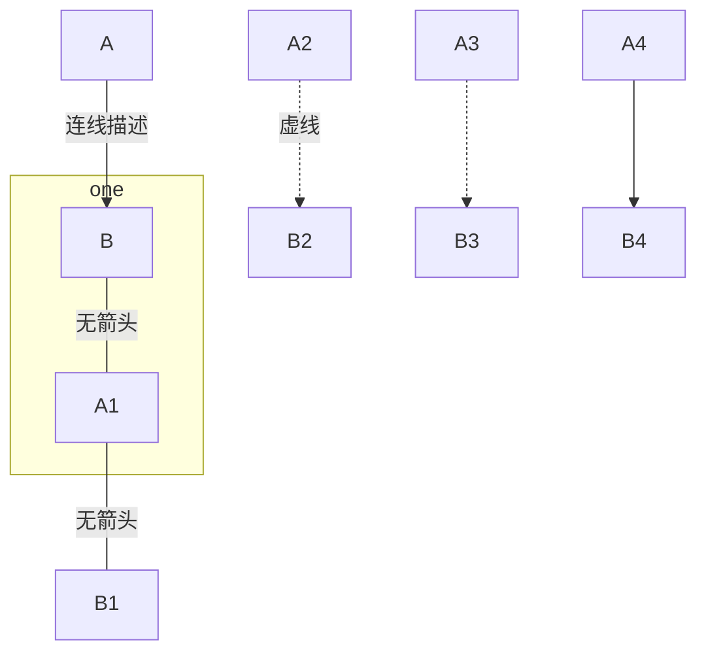

1、时序图**sequence**

```sequence
aaa->bbb:ccc
aaa->ddd:ccc
```

2、流程图**mermaid**


```mermaid
graph TD
   A[A] --连线描述--> B[B]
   A1[A1] --无箭头--- B1[B1]
   A2[A2] -.虚线.-> B2[B2]
   A3[A3] -.-> B3[B3]
   A4[A4] --> B4[B4]
   subgraph one
    B[B] --无箭头--- A1[A1]
   end
```